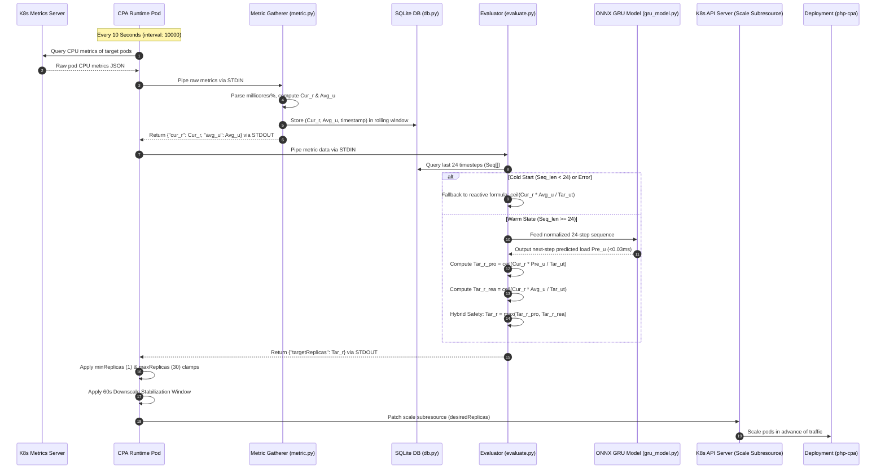

# Custom Pod Autoscaler (CPA) - Complete Flow & Codebase Walkthrough

This document explains the end-to-end operational flow and codebase implementation of the **Proactive Custom Pod Autoscaler (CPA)** based on the research paper:
> *"Toward Optimal Load Prediction and Customizable Autoscaling Scheme for Kubernetes"* (MDPI Mathematics 2023).

---

## 1. High-Level Architecture & Lifecycle Flow

Standard Kubernetes HPA is **reactive**: it only observes elevated CPU load after packets saturate pods, creating a **50–60 second delay** before new replicas become ready.

The **Custom Pod Autoscaler (CPA)** replaces this reactive loop with a customized 2-phase control loop orchestrated by the [CPA Operator](file:///e:/Repositories/cloudcomp-k8s-autoscaler/k8s-proactive-autoscaler/manifests/crd-operator/cpa-operator.yaml) every **10 seconds** (`interval: "10000"` in [cpa.yaml](file:///e:/Repositories/cloudcomp-k8s-autoscaler/k8s-proactive-autoscaler/manifests/cpa.yaml)):

---

## 2. Step-by-Step Execution Breakdown

### Step 1: Control Loop Trigger & Configuration
* Configured by [k8s-metrics-cpu/config.yaml](file:///e:/Repositories/cloudcomp-k8s-autoscaler/k8s-proactive-autoscaler/k8s-metrics-cpu/config.yaml) and [manifests/cpa.yaml](file:///e:/Repositories/cloudcomp-k8s-autoscaler/k8s-proactive-autoscaler/manifests/cpa.yaml).
* The [CPA Operator](file:///e:/Repositories/cloudcomp-k8s-autoscaler/k8s-proactive-autoscaler/manifests/crd-operator/cpa-operator.yaml) starts a dedicated pod running the image defined in [k8s-metrics-cpu/Dockerfile](file:///e:/Repositories/cloudcomp-k8s-autoscaler/k8s-proactive-autoscaler/k8s-metrics-cpu/Dockerfile).
* Every **10,000 ms** (10 seconds), the CPA runtime queries the cluster’s Metrics Server API for the CPU utilization of the target deployment (`php-cpa`).

---

### Step 2: Metric Gathering (`metric.py`)
Defined in [k8s-metrics-cpu/metric.py](file:///e:/Repositories/cloudcomp-k8s-autoscaler/k8s-proactive-autoscaler/k8s-metrics-cpu/metric.py#L47-L132):
1. **Reads STDIN:** The CPA runtime passes Kubernetes metrics JSON via standard input.
2. **Normalizes Pod CPU Usage:**
   * Reads raw CPU usage strings (e.g., `150m` millicores or utilization percentages) via `parse_cpu_value()`.
   * For container resource metrics, computes utilization against pod requests:
     $$\text{utilization\_pct} = \left(\frac{\text{pod\_cpu\_usage}}{\text{pod\_cpu\_request}}\right) \times 100$$
3. **Averages CPU Utilization:** Computes current active replica count ($Cur\_r$) and mean CPU load ($Avg\_u$):
   $$Avg\_u = \frac{\sum \text{utilization\_pct}}{Cur\_r}$$
4. **Appends to SQLite Rolling Store:**
   * Calls [db.py](file:///e:/Repositories/cloudcomp-k8s-autoscaler/k8s-proactive-autoscaler/k8s-metrics-cpu/db.py#L42-L54) (`MetricsDatabase.insert_metric`) to store `(timestamp, avg_u, cur_r)` at `/tmp/metrics.db`.
   * Automatically prunes records older than the last 1,000 points to keep memory and storage footprint minimal.
5. **Returns JSON:** Outputs `{"cur_r": Cur_r, "avg_u": Avg_u}` to `stdout` for the CPA evaluator hook.

---

### Step 3: Predictive Evaluation (`evaluate.py`)
Defined in [k8s-metrics-cpu/evaluate.py](file:///e:/Repositories/cloudcomp-k8s-autoscaler/k8s-proactive-autoscaler/k8s-metrics-cpu/evaluate.py#L101-L185):
1. **Reads STDIN:** Receives the current cluster status (`cur_r` and `avg_u`) along with target CPU utilization ($Tar\_ut = 50\%$, configured by `TARGET_CPU_UTILIZATION`).
2. **Fetches Sequence Window:**
   * Queries SQLite via `db.get_recent_sequence(n_steps=24)`.
   * Checks historical sequence length ($Seq\_len$).

3. **Branch A: Cold-Start / Fallback Phase ($Seq\_len < 24$):**
   * If the autoscaler just started and fewer than 24 time intervals (240 seconds / 4 minutes) have passed, AI inference cannot run safely.
   * It executes the **reactive HPA calculation**:
     $$Tar\_r = \left\lceil Cur\_r \times \frac{Avg\_u}{Tar\_ut} \right\rceil$$
   * This guarantees cluster availability from second zero.

4. **Branch B: Proactive GRU Inference ($Seq\_len \ge 24$):**
   * Normalizes the 24 historical values into $[0, 1]$ using bounds in [saved_models/scaler.json](file:///e:/Repositories/cloudcomp-k8s-autoscaler/k8s-proactive-autoscaler/k8s-metrics-cpu/saved_models/scaler.json).
   * Passes the $(1, 24, 1)$ tensor into [GRUInferenceEngine](file:///e:/Repositories/cloudcomp-k8s-autoscaler/k8s-proactive-autoscaler/model/gru_model.py#L118-L203) using `GRU_Model_24.onnx`.
   * **Inference latency:** $\sim 0.03\text{ ms}$ on standard CPU (zero GPU required).
   * Generates future workload prediction: $Pre\_u$.
   * Computes proactive replica requirement:
     $$Tar\_r_{proactive} = \left\lceil Cur\_r \times \frac{Pre\_u}{Tar\_ut} \right\rceil$$
   * Computes reactive safety replica requirement:
     $$Tar\_r_{reactive} = \left\lceil Cur\_r \times \frac{Avg\_u}{Tar\_ut} \right\rceil$$
   * **Hybrid Safety Maximizer:**
     $$Tar\_r = \max(Tar\_r_{proactive}, Tar\_r_{reactive})$$
     *Why this matters:* If an unpredicted burst or flash crowd occurs that the GRU model did not forecast, the reactive calculation immediately overrides to prevent under-provisioning.

5. **Returns JSON:** Outputs `{"targetReplicas": Tar_r}` to `stdout`.

---

### Step 4: Actuation & Pod Stabilization
1. **Replica Clamping:**
   * The CPA Operator parses `targetReplicas` and bounds it to `[minReplicas, maxReplicas]` ($[1, 30]$ as defined in [manifests/cpa.yaml](file:///e:/Repositories/cloudcomp-k8s-autoscaler/k8s-proactive-autoscaler/manifests/cpa.yaml#L8-L9)).
2. **Downscale Stabilization:**
   * Uses `downscaleStabilization: "60"`.
   * When traffic drops, replicas are kept warm for 60 seconds before termination. This stops pod thrashing / flapping caused by momentary traffic dips.
3. **K8s Scale Subresource Update:**
   * The CPA Operator sends a PATCH request to the Kubernetes API targeting `spec.replicas` on the `php-cpa` Deployment.
   * New pods finish container initialization **before** the predicted traffic spike arrives at the ingress.

---

## 3. Summary of Key Files

| Component | File | Role |
| :--- | :--- | :--- |
| **CRD Manifest** | [manifests/cpa.yaml](file:///e:/Repositories/cloudcomp-k8s-autoscaler/k8s-proactive-autoscaler/manifests/cpa.yaml) | Defines interval (10s), targets (`php-cpa`), bounds (1–30), and stabilization (60s). |
| **CPA Framework Config** | [k8s-metrics-cpu/config.yaml](file:///e:/Repositories/cloudcomp-k8s-autoscaler/k8s-proactive-autoscaler/k8s-metrics-cpu/config.yaml) | Defines execution hooks (`shell -> /metric.py`, `shell -> /evaluate.py`). |
| **Metric Gatherer** | [k8s-metrics-cpu/metric.py](file:///e:/Repositories/cloudcomp-k8s-autoscaler/k8s-proactive-autoscaler/k8s-metrics-cpu/metric.py) | Ingests pod metrics, calculates $Avg\_u$, and writes to SQLite. |
| **Rolling Storage** | [k8s-metrics-cpu/db.py](file:///e:/Repositories/cloudcomp-k8s-autoscaler/k8s-proactive-autoscaler/k8s-metrics-cpu/db.py) | Embedded SQLite database keeping a rolling window of metrics. |
| **Evaluator Engine** | [k8s-metrics-cpu/evaluate.py](file:///e:/Repositories/cloudcomp-k8s-autoscaler/k8s-proactive-autoscaler/k8s-metrics-cpu/evaluate.py) | Manages cold-start fallback, executes GRU inference, and computes hybrid target replicas. |
| **GRU Model & Engine** | [model/gru_model.py](file:///e:/Repositories/cloudcomp-k8s-autoscaler/k8s-proactive-autoscaler/model/gru_model.py) | 50 hidden unit GRU network running via ONNX Runtime (<0.03ms latency, <120MB image). |
