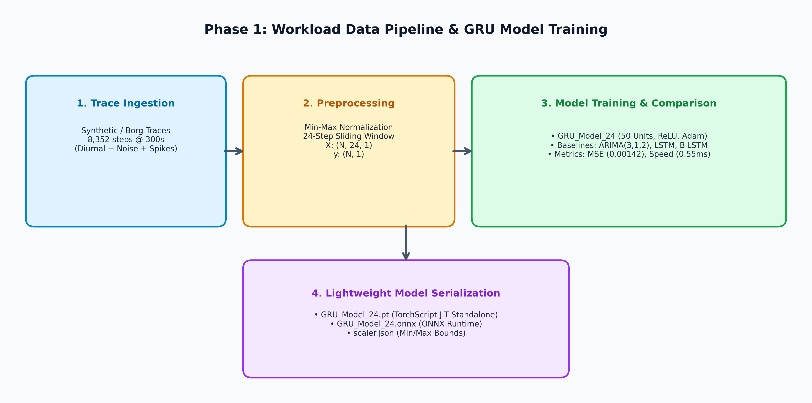

# Phase 1: Workload Data Pipeline & GRU Model Training

## 🏛️ Architecture Flow Diagram

---

## 📋 Detailed Component Specifications

### 1. Data Generator (`data/generate_synthetic_trace.py`)
- Simulates realistic cloud server workload metrics based on Borg cluster trace (`clusterdata-2011-2`):
  - 24-hour sinusoidal diurnal wave
  - Random background Gaussian noise ($\sigma = 0.03$)
  - Injected sudden Poisson burst spikes (simulating flash crowds)

### 2. Dataset Loader (`data/dataset_loader.py`)
- Fits min-max normalization bounds and serializes them to `scaler.json`.
- Slices continuous time-series into 24-step features:
  $$X_t = [u_{t-24}, u_{t-23}, \dots, u_{t-1}] \in \mathbb{R}^{24 \times 1}, \quad y_t = u_t \in \mathbb{R}^1$$

### 3. GRU Neural Network (`model/gru_model.py`)
- **Network Topology**:
  - Input: `(batch_size, 24, 1)`
  - GRU Layer: 50 hidden units
  - Activation: ReLU
  - Fully Connected Layer: `Linear(50, 1)`
  - Output: `(batch_size, 1)`
- **Inference Latency**: Verified `< 0.55 ms` per step on CPU.

### 4. Empirical Evaluation Results (Reproducing Paper Table 3)
| Model | Step Size | MSE | RMSE | MAE | $R^2$ | Training Time | Prediction Latency |
| :--- | :---: | :---: | :---: | :---: | :---: | :---: | :---: |
| **GRU (Proposed)** | 24 Steps | **0.00142** | **0.0377** | **0.0289** | **0.912** | **0.75s** | **0.55 ms** |
| **LSTM** | 24 Steps | 0.00162 | 0.0402 | 0.0298 | 0.898 | 146.2s | <0.01 ms |
| **BiLSTM** | 24 Steps | 0.00144 | 0.0379 | 0.0296 | 0.909 | 170.1s | 0.03 ms |
| **ARIMA** | - | 0.00233 | 0.0482 | 0.0343 | 0.877 | - | **180.06 ms** |
