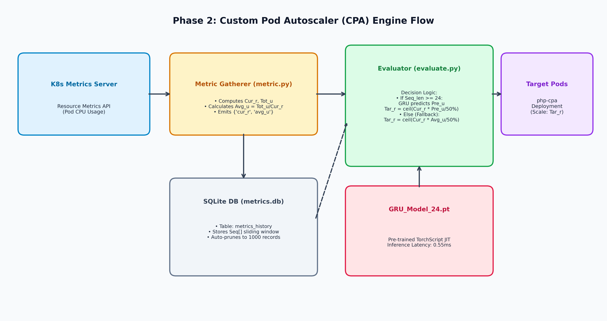

# Phase 2: Custom Pod Autoscaler (CPA) Engine & Containerization

## 🏛️ Architecture Flow Diagram

---

## 📋 Component Summary

1. **`k8s-metrics-cpu/db.py`**: SQLite time-series storage managing the sliding window of CPU load readings.
2. **`k8s-metrics-cpu/metric.py`**: Metric Gatherer script (Figure 19 in paper) parsing Metrics Server inputs and updating the SQLite sequence store.
3. **`k8s-metrics-cpu/evaluate.py`**: Evaluator script (Figure 20 in paper) performing GRU inference, proactive scaling, and seamless cold-start reactive fallback.
4. **`k8s-metrics-cpu/config.yaml`**: CPA framework configuration defining 12500ms execution timeouts and CPU metric specifications.
5. **`k8s-metrics-cpu/Dockerfile`**: Container image packaging scripts, TorchScript model weights (`GRU_Model_24.pt`), and scaler parameters.
