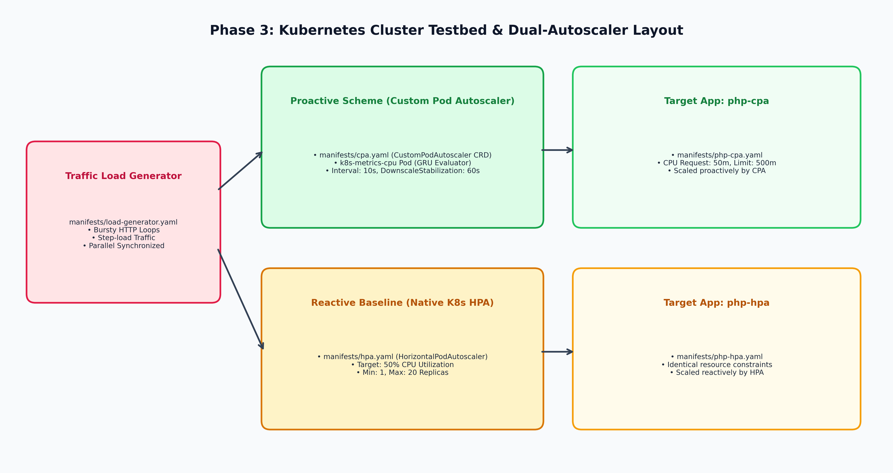

# Phase 3: Kubernetes Manifests & Benchmark Workloads

## 🏛️ Architecture Flow Diagram

---

## 📋 Manifest Specifications

| Manifest File | Target Component | Purpose & Configuration |
| :--- | :--- | :--- |
| [`manifests/php-cpa.yaml`](file:///e:/Repositories/cloudcomp-k8s-autoscaler/k8s-proactive-autoscaler/manifests/php-cpa.yaml) | `Deployment` & `Service` | Proactive autoscaling target running `registry.k8s.io/hpa-example` CPU-stress loops (Request: 50m, Limit: 500m). |
| [`manifests/php-hpa.yaml`](file:///e:/Repositories/cloudcomp-k8s-autoscaler/k8s-proactive-autoscaler/manifests/php-hpa.yaml) | `Deployment` & `Service` | Reactive baseline target with identical resource limits/requests for fair comparison. |
| [`manifests/cpa.yaml`](file:///e:/Repositories/cloudcomp-k8s-autoscaler/k8s-proactive-autoscaler/manifests/cpa.yaml) | `CustomPodAutoscaler` | Proactive autoscaler CRD targeting `php-cpa` with `interval: 10000ms`, `downscaleStabilization: 60s`. |
| [`manifests/hpa.yaml`](file:///e:/Repositories/cloudcomp-k8s-autoscaler/k8s-proactive-autoscaler/manifests/hpa.yaml) | `HorizontalPodAutoscaler` | Standard native HPA targeting `php-hpa` with 50% CPU target utilization and 60s stabilization window. |
| [`manifests/load-generator.yaml`](file:///e:/Repositories/cloudcomp-k8s-autoscaler/k8s-proactive-autoscaler/manifests/load-generator.yaml) | `Deployment` | Generates synchronized HTTP traffic bursts against both `http://php-cpa` and `http://php-hpa`. |
| [`manifests/crd-operator/`](file:///e:/Repositories/cloudcomp-k8s-autoscaler/k8s-proactive-autoscaler/manifests/crd-operator/) | Helm / Shell scripts | Installs Custom Pod Autoscaler Operator `v1.2.1` into the cluster. |
