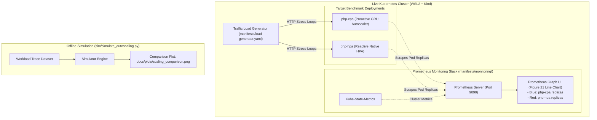

# Phase 4: Prometheus Monitoring, Simulation & Live Benchmarking

## 🏛️ Architecture Flow Diagram

---

## 📋 Phase 4 Deliverables

1. **Prometheus Monitoring Stack (`manifests/monitoring/`)**:
   - `prometheus.yaml`: Prometheus deployment, ConfigMap, and ClusterIP/NodePort service.
   - `setup_monitoring.sh` / `setup_monitoring.ps1`: Automated installation script for Prometheus & kube-state-metrics.
   - Live Prometheus queries matching Figure 21:
     - `kube_deployment_status_replicas{deployment="php-cpa"}` (Blue line)
     - `kube_deployment_status_replicas{deployment="php-hpa"}` (Red line)
2. **Offline Simulation Engine (`sim/simulate_autoscaling.py`)**:
   - Compares Proactive CPA vs. Reactive HPA over synthetic/Borg traces.
   - Generates `docs/plots/scaling_comparison.png` (reproducing Figure 21).
   - Computes SLA violation reduction and reaction lag metrics.
3. **Live Deployment Guide (`docs/live_cluster_guide.md`)**:
   - Step-by-step instructions for running in WSL2 + Kind.
4. **Automated Verification Tests (`tests/test_simulator.py`)**.
